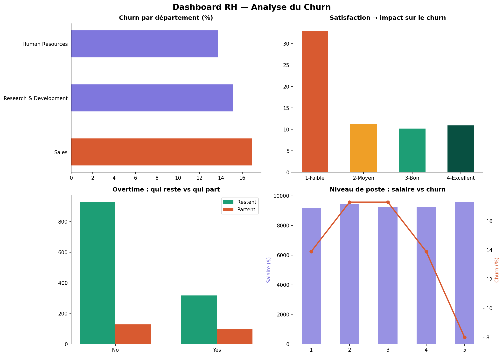

# Analyse RH & Churn Employes — SQL + Power BI


---



---

## C'est quoi ce projet

J'ai travaille sur une problematique RH concrete : pourquoi les employes quittent-ils une entreprise, et est-ce qu'on peut identifier les profils les plus a risque avec les donnees ?

Le dataset contient 1 470 employes avec des informations sur leur departement, salaire, satisfaction au travail, anciennete, heures supplementaires et bien d'autres variables. Le taux de churn global est de 15.5%.

L'idee c'etait de ne pas rester sur un simple notebook de visualisation. J'ai voulu travailler comme on le ferait dans un vrai contexte pro : charger les donnees dans une base SQL, ecrire des requetes pour extraire les insights, puis exporter les resultats vers Power BI pour un rendu dashboard qui parle a quelqu'un qui ne lit pas du code.

---

## Ce que j'ai fait

**Partie 1 — Analyse SQL avec Python**

J'ai charge le dataset dans une base SQLite via Python et j'ai ecrit des requetes de plus en plus avancees :

- Requetes basiques : SELECT, GROUP BY, ORDER BY, CASE WHEN
- Requetes avancees : CTE (WITH), Window Functions (RANK, OVER, PARTITION BY), JOIN

Ce que j'ai trouve interessant c'est que les Window Functions m'ont permis de faire des choses qu'on ne peut pas faire avec un simple GROUP BY — par exemple calculer le rang du churn de chaque departement sans perdre le detail des lignes.

**Partie 2 — Dashboard Power BI**

J'ai exporte les donnees agregees vers Power BI et construit un dashboard avec des mesures DAX et des filtres par departement, genre et overtime. L'objectif c'etait de produire quelque chose qu'un DRH peut lire sans connaitre le SQL.

---

## Les insights principaux

- **Churn avec overtime : x2** — les employes qui font des heures sup partent deux fois plus que les autres
- **Satisfaction faible = 33% de churn** — c'est le facteur le plus predictif identifie
- **Sales est le departement le plus a risque** (~17% de churn)
- **Les employes en debut de carriere (job level 1)** partent plus malgre des salaires comparables

---

## Stack technique

| Outil | Usage |
|---|---|
| Python + Pandas | Chargement et preparation des donnees |
| SQLite | Base de donnees relationnelle |
| SQL | Analyse et extraction des insights |
| Matplotlib | Visualisation dans le notebook |
| Power BI + DAX | Dashboard interactif |

---

## Structure

```
hr-churn-analysis/
├── hr_data.csv               <- dataset source
├── hr_powerbi_data.xlsx      <- donnees exportees pour Power BI
├── hr_sql_analysis.ipynb     <- notebook complet (SQL + visualisations)
└── hr_dashboard.png          <- capture du dashboard final
```

---

## Ce que j'ai appris

Ce projet m'a surtout appris a penser en termes de questions metier avant de coder. Avant d'ecrire une requete, je me demandais : qu'est-ce que je cherche a comprendre exactement ? Ca change la facon d'aborder le SQL — on n'ecrit pas des requetes pour le plaisir, on cherche a repondre a quelque chose de precis.

La partie Power BI m'a aussi montree pourquoi la communication des resultats est aussi importante que l'analyse elle-meme. Un insight qu'on ne sait pas presenter reste invisible.

---

## A propos

Barbare Lina — Etudiante en Master 1 sciences et ingenieurie de données 
